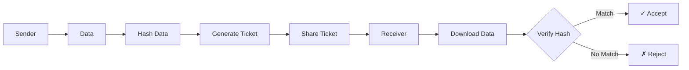
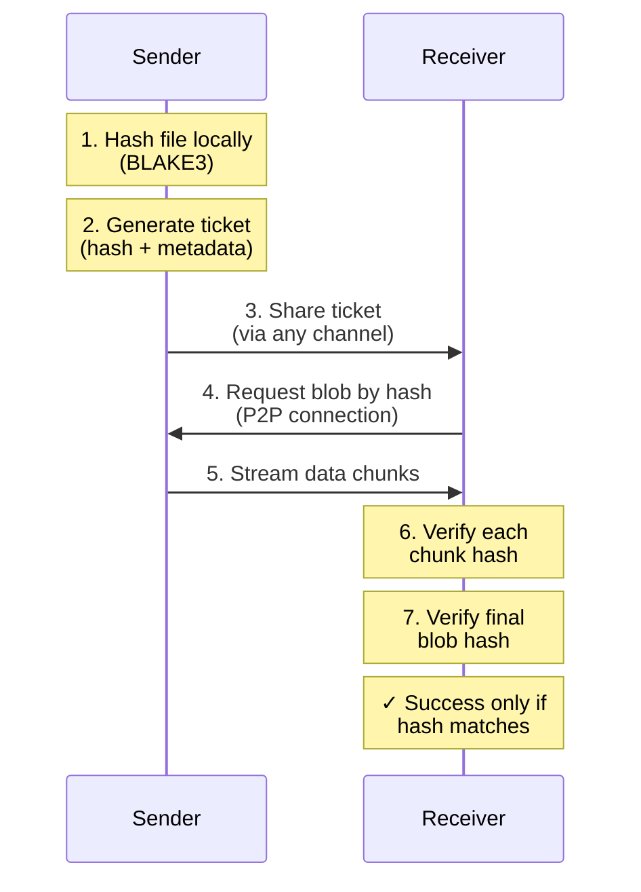
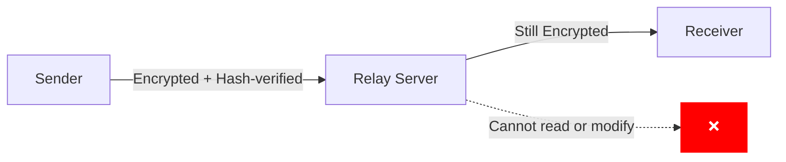
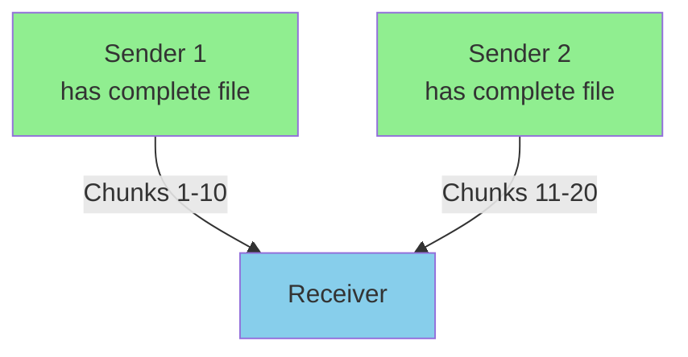
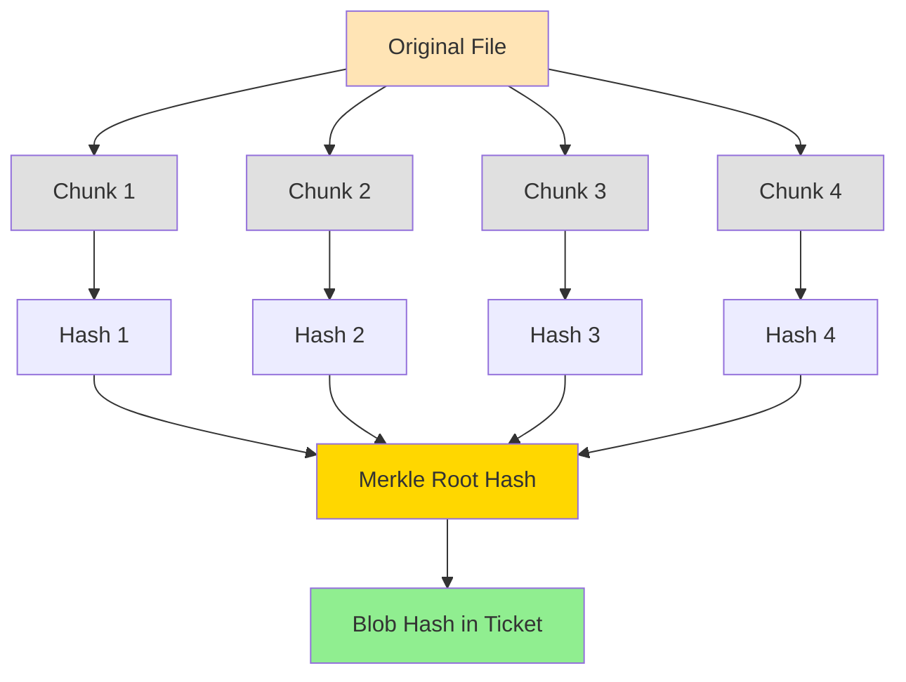

# Why the Iroh Blobs Protocol is Insanely Cool

## Overview

[sendme](https://github.com/n0-computer/sendme) is a file transfer tool built on the [Iroh](https://iroh.computer/) blobs protocol. This document explains the security properties of the protocol and why sendme represents a significant advancement in peer-to-peer file sharing.

## What is Iroh?

Iroh is a next-generation networking library that provides content-addressed, peer-to-peer data transfer with built-in security. The blobs protocol is Iroh's fundamental data structure for storing and transferring immutable data.

## Security Properties

### 1. Content Addressing (Hash-Based Verification)

**How it works:**
- Every blob is identified by its cryptographic hash (BLAKE3)
- When you request data, you request it by its hash
- Upon receiving data, the hash is recalculated and verified

**Why it's safe:**



- **Tamper-proof**: If even a single bit is modified, the hash verification fails
- **No trust required**: You don't need to trust the sender or any intermediate node
- **Automatic integrity**: Corruption detection happens automatically
- **Man-in-the-middle resistant**: An attacker can't modify data in transit without detection

### 2. Cryptographic Hash Functions (BLAKE3)

**BLAKE3 properties:**
- Collision resistance: Computationally infeasible to find two different inputs with the same hash
- Pre-image resistance: Cannot reverse the hash to find the original data
- Avalanche effect: Tiny changes in input cause massive changes in output
- Fast: Optimized for modern hardware with SIMD support

**Security guarantee:**
```
Probability of hash collision ≈ 1 / 2^256
More likely: Every atom in the universe spontaneously forming a working computer
```

### 3. No Centralized Trust

Traditional file sharing relies on:
- Trusting the server
- Trusting DNS
- Trusting TLS certificate authorities
- Trusting the network path

Iroh blobs only requires:
- **Trusting mathematics**: Hash functions are based on well-studied cryptographic primitives
- **Trusting your own verification**: You verify the hash yourself

### 4. End-to-End Verification



### 5. Private by Default

- **No metadata leakage**: File names, sizes, and content are not exposed to the network
- **Direct connections**: Peer-to-peer transfer without intermediaries
- **Ticket-based access**: Only those with the ticket can request the blob
- **No indexing**: Content is not searchable or discoverable without the ticket

### 6. NAT Traversal Security

Iroh uses:
- **Hole punching**: Establishes direct P2P connections when possible
- **Relay servers**: Only when direct connection fails, and data is still hash-verified
- **Encrypted transport**: All data in transit is encrypted using QUIC/TLS 1.3

Even if relayed:



## Why sendme is Cool

### 1. Zero Configuration

```bash
# Send a file (literally this simple)
sendme file.txt

# Receive a file
sendme get <ticket>
```

No accounts, no servers, no setup. Just works.

### 2. Smart Transfer Resume

**Problem with traditional tools:**
```
Connection drops at 99% → Start over from 0%
```

**sendme approach:**
```
Connection drops at 99% → Resume from 99%
Chunks already verified   → Skip re-download
```

Built on Iroh's chunking:
- Files split into verifiable chunks
- Each chunk independently verified
- Resume from any point
- Parallel chunk download from multiple peers

### 3. Offline-First Design

```bash
# Sender generates ticket
sendme file.txt
# Prints: iroh-blob://...

# Sender can now go offline
# File is stored locally

# Receiver can start download later
sendme get iroh-blob://...

# When sender comes back online
# Transfer resumes automatically
```

The ticket is valid indefinitely because:
- It contains the cryptographic hash
- Hash never changes
- Sender can share the data whenever they're online

### 4. Multi-Source Downloads



- Download from multiple sources simultaneously
- Even if original sender goes offline
- BitTorrent-like swarming, but simpler
- Each chunk verified independently

### 5. No File Size Limits

Traditional file sharing:
- Email: ~25 MB
- Slack: 1 GB
- Google Drive: Quota-limited
- WeTransfer: 2 GB free, time-limited

sendme:
- **Only limited by disk space**
- **No time limits**
- **No server quotas**
- **No artificial restrictions**

### 6. Works Anywhere

```
✓ Behind NAT
✓ Corporate firewall
✓ Mobile networks
✓ VPN connections
✓ IPv4 and IPv6
✓ Cross-platform (macOS, Linux, Windows)
```

Iroh's connection establishment:
1. Try direct connection (fastest)
2. Try STUN hole punching (still fast)
3. Fall back to relay (slower, but works)

### 7. Bandwidth Efficient

**Problem: Redundant transfers**
```
Send file.txt to Person A
Send file.txt to Person B
Send file.txt to Person C
→ 3× upload bandwidth used
```

**Iroh solution:**
```
Share file.txt once → Generate ticket
Share ticket with A, B, C
They can share chunks among themselves
→ Could use <1× upload bandwidth (swarming)
```

### 8. Privacy Focused

- **No tracking**: No analytics, no logging
- **No accounts**: No email, no phone number, no personal info
- **No server storage**: Files never leave your control
- **No cloud**: Everything is peer-to-peer
- **Open source**: Auditable security

## Real-World Scenarios

### Scenario 1: Sending Large Files to Colleagues

**Traditional approach:**
1. Upload to Google Drive (slow, quota limits)
2. Share link
3. Colleague downloads (uses their quota)
4. File stays on Google servers forever (privacy concern)

**sendme approach:**
```bash
# You
sendme project-files.zip
# Share ticket: iroh-blob://abc123...

# Colleague
sendme get iroh-blob://abc123...
```

- No upload to cloud
- No storage quotas
- No privacy concerns
- File deleted when you want

### Scenario 2: Emergency File Access

**Problem:**
Your computer is off, but someone needs a file urgently.

**sendme solution:**
```bash
# Create collection and get ticket
sendme important-docs/
# Save ticket somewhere accessible (email, notes, etc.)

# Later, from any device:
sendme get <ticket>
# When your original computer comes online, transfer happens
```

### Scenario 3: Resumable Large Transfers

**Traditional:**
```
Downloading 50GB backup over hotel WiFi
Connection drops every 30 minutes
→ Restart from beginning each time
→ Never completes
```

**sendme:**
```bash
sendme get <ticket>
# Download 10GB → Connection drops
# Restart → Resume from 10GB
# Download 15GB more → Connection drops
# Restart → Resume from 25GB
# Eventually completes, no matter how many interruptions
```

## Technical Deep Dive

### Content-Addressed Storage

```rust
// Simplified concept
struct Blob {
    hash: Blake3Hash,      // 256-bit cryptographic hash
    size: u64,             // File size in bytes
    chunks: Vec<ChunkHash> // Hashes of individual chunks
}

struct Ticket {
    blob: BlobHash,        // Root hash
    format: BlobFormat,    // Single blob or collection
    nodes: Vec<NodeAddr>   // Optional: peer addresses
}
```

### Why Hash-Based Verification is Unbreakable

**Attack scenario 1: Modified file**
```
Attacker intercepts transfer
Changes "Invoice: $100" to "Invoice: $10000"
Hash changes: abc123... → def456...
Receiver expects: abc123...
Receiver gets hash: def456...
→ Verification fails, file rejected
```

**Attack scenario 2: Hash collision**
```
Attacker tries to find different data with same hash
Computing power required: 2^128 operations
Time required: Heat death of the universe × 10^20
→ Computationally infeasible
```

**Attack scenario 3: Man-in-the-middle**
```
Attacker provides different blob
Correct hash: abc123...
Attacker's hash: xyz789...
Receiver verifies: xyz789... ≠ abc123...
→ Rejected
```

### Chunk-Level Verification

**File split into chunks:**



Each chunk independently verified:
- Download corruption detected immediately
- Only corrupted chunks re-downloaded
- Parallel verification for speed

## Comparison with Other Tools

| Feature | sendme | WeTransfer | Dropbox | Magic Wormhole |
|---------|--------|------------|---------|----------------|
| File size limit | None | 2 GB (free) | Quota | None |
| Time limit | None | 7 days | Forever (quota) | Session-based |
| P2P transfer | Yes | No | No | Yes |
| Resume support | Yes | No | Yes | No |
| Privacy | Full | Minimal | Minimal | Good |
| Requires account | No | No (sender) | Yes | No |
| Hash verification | Yes | No | Checksum | Yes |
| Multi-source | Yes | No | No | No |
| Works offline | Yes | No | Sync only | No |

## Security Guarantees Summary

✅ **Cannot be tampered with**: Hash verification catches any modification
✅ **Cannot be corrupted**: Chunk-level verification ensures integrity
✅ **Cannot be spoofed**: Content addressing prevents impersonation
✅ **Cannot be intercepted**: Encrypted transport protects confidentiality
✅ **Cannot be censored**: Peer-to-peer, no central servers
✅ **Cannot be tracked**: No telemetry, no user accounts
✅ **Cannot be backdoored**: Open source, auditable code

## Common Questions

### Q: Is the ticket secret?

**Short answer:** Yes, treat it like a password.

**Details:**
- Anyone with the ticket can request the blob
- However, they can only get what the hash describes
- They cannot modify it without detection
- You control when you're online to serve it

### Q: What if I share the wrong ticket?

If you accidentally share the wrong ticket:
- Recipient downloads wrong file
- You notice the mistake
- Share correct ticket
- No harm done (recipient can verify hash matches what they expect)

### Q: Can someone guess my ticket?

**Probability of guessing:**
```
256-bit hash space = 2^256 possible values
≈ 115,792,089,237,316,195,423,570,985,008,687,907,853,269,984,665,640,564,039,457,584,007,913,129,639,936

Guess rate: 1 trillion per second
Time to guess: 3.67 × 10^51 years
Age of universe: 1.38 × 10^10 years

→ Effectively impossible
```

### Q: What if Iroh servers go down?

**There are no Iroh servers** (mostly):
- File transfer is peer-to-peer
- You don't depend on any company staying in business
- Optional relay servers for NAT traversal (fallback only)
- You can run your own relay if needed

### Q: How is this different from BitTorrent?

| Aspect | Iroh/sendme | BitTorrent |
|--------|-------------|------------|
| Use case | Ad-hoc file sharing | Distributed downloads |
| Setup | Zero config | Need tracker/DHT |
| Privacy | Private by default | Public by default |
| Discoverability | Ticket required | Searchable torrents |
| Resume | Automatic | Requires same torrent |
| API | Simple library | Complex protocol |

## Conclusion

The Iroh blobs protocol is safe because:
1. **Mathematics** - Based on proven cryptographic hash functions
2. **Verification** - Every bit is checked, always
3. **No trust required** - You verify everything yourself
4. **Open source** - Security through transparency
5. **End-to-end** - No intermediaries can tamper

sendme is cool because:
1. **Simple** - Just works, no configuration
2. **Smart** - Resume, multi-source, chunked
3. **Private** - No servers, no tracking
4. **Reliable** - Works behind NAT, over bad connections
5. **Unlimited** - No file size or time restrictions
6. **Fast** - Parallel downloads, efficient protocol

Together, they represent a fundamental rethinking of how file sharing should work: secure by default, private by design, and delightfully simple to use.

## Further Reading

- [Iroh Documentation](https://iroh.computer/docs)
- [sendme Repository](https://github.com/n0-computer/sendme)
- [BLAKE3 Paper](https://github.com/BLAKE3-team/BLAKE3-specs/blob/master/blake3.pdf)
- [Content Addressing](https://en.wikipedia.org/wiki/Content-addressable_storage)
- [QUIC Protocol](https://www.rfc-editor.org/rfc/rfc9000.html)

---

**Note:** This document is for educational purposes. While Iroh and sendme are production-ready, always evaluate security tools in the context of your specific threat model and use case.
