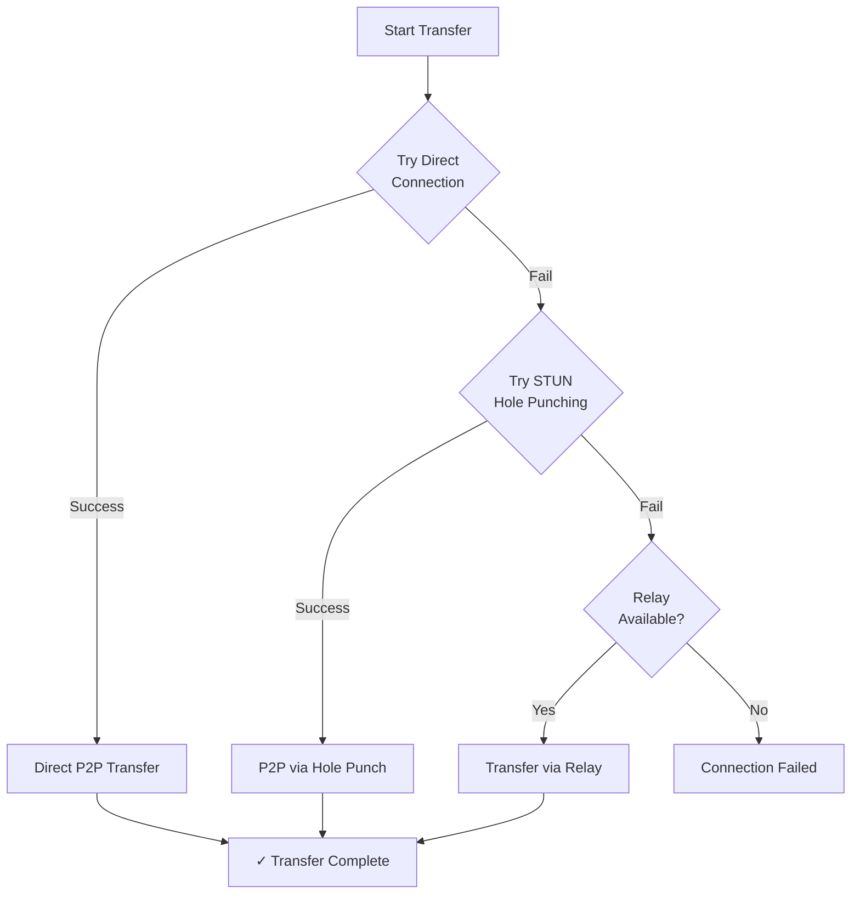

# sendme CLI Reference

## Overview

**sendme** is a command-line tool for sending files and directories between machines using BLAKE3-verified streaming over the Iroh network protocol. It provides secure, peer-to-peer file transfer with automatic verification and resumability.

**Version:** 0.31.0
**Protocol:** Iroh blobs
**Hash Algorithm:** BLAKE3
**License:** MIT/Apache-2.0

### Key Features

- **BLAKE3 Verification** - Cryptographic integrity checking for all transfers
- **Peer-to-Peer** - Direct connections with automatic NAT traversal
- **Resumable** - Interrupted transfers can be resumed from where they stopped
- **No File Size Limits** - Transfer files of any size
- **Zero Configuration** - Works out of the box with sensible defaults
- **Cross-Platform** - macOS, Linux, Windows support

## Installation

sendme is distributed as a standalone binary. Download the latest release for your platform:

### Manual Installation

```bash
# macOS (Apple Silicon)
curl -L https://github.com/n0-computer/sendme/releases/latest/download/sendme-darwin-aarch64.tar.gz | tar xz
sudo mv sendme /usr/local/bin/

# macOS (Intel)
curl -L https://github.com/n0-computer/sendme/releases/latest/download/sendme-darwin-x86_64.tar.gz | tar xz
sudo mv sendme /usr/local/bin/

# Linux (x86_64)
curl -L https://github.com/n0-computer/sendme/releases/latest/download/sendme-linux-x86_64.tar.gz | tar xz
sudo mv sendme /usr/local/bin/

# Windows (x86_64)
# Download from: https://github.com/n0-computer/sendme/releases/latest/download/sendme-windows-x86_64.zip
# Extract and add to PATH
```

### Verify Installation

```bash
sendme --version
# Output: sendme 0.31.0
```

## Quick Start

### Send a File

```bash
sendme send myfile.txt
```

**Output:**
```
Providing 1 file(s) with a total size of 1.2 KiB
Listening on:
  - 192.168.1.100:54321
  - [fe80::1234:5678:9abc:def0]:54321

To receive this data, use:
  sendme receive iroh-blob:AaB...
```

### Receive a File

Copy the ticket from the sender and run:

```bash
sendme receive iroh-blob:AaB...
```

**Output:**
```
Connecting to sender...
Connected!
Receiving: myfile.txt (1.2 KiB)
[████████████████████] 1.2 KiB/1.2 KiB (100%)
✓ Received and verified: myfile.txt
```

## Command Reference

### Global Options

```bash
sendme [OPTIONS] <COMMAND>
```

| Option | Description |
|--------|-------------|
| `-h, --help` | Print help information |
| `-V, --version` | Print version information |

### Environment Variables

| Variable | Purpose | Example |
|----------|---------|---------|
| `IROH_SECRET` | Specify a secret key for the node | `IROH_SECRET=abc123...` |

**Note:** If `IROH_SECRET` is not set, a random secret key is generated for each session.

---

## `sendme send` - Send Files or Directories

Shares a file or directory, generating a ticket that receivers use to download.

### Syntax

```bash
sendme send [OPTIONS] <PATH>
```

### Arguments

| Argument | Required | Description |
|----------|----------|-------------|
| `<PATH>` | Yes | Path to file or directory to send |

**Behavior:**
- The last component of the path becomes the name shared with receivers
- Example: `sendme send /path/to/myfile.txt` shares as `myfile.txt`
- Directories are transferred recursively

### Options

#### `--ticket-type <TYPE>`

Controls what information is included in the ticket.

**Values:**
- `id` - Only endpoint ID (shortest, least reliable)
- `addresses` - Endpoint ID + IP addresses (no relay)
- `relay` - Endpoint ID + relay URL (no direct addresses)
- `relay-and-addresses` - **[Default]** All connection methods (most reliable)

**Use Cases:**
```bash
# Maximum compatibility (default)
sendme send myfile.txt

# Debug direct connections only
sendme send --ticket-type addresses myfile.txt

# Debug relay-only connections
sendme send --ticket-type relay myfile.txt

# Minimal ticket size (may fail behind NAT)
sendme send --ticket-type id myfile.txt
```

**Recommendation:** Use default unless debugging connectivity issues.

#### `--magic-ipv4-addr <ADDR>`

Specify the IPv4 address and port for the magic socket listener.

**Format:** `IP:PORT`

**Default:** Random free port on all interfaces

**Example:**
```bash
sendme send --magic-ipv4-addr 192.168.1.100:12345 myfile.txt
```

**Use Cases:**
- Firewall rules require specific ports
- Multiple sendme instances on same machine
- Port forwarding configuration

#### `--magic-ipv6-addr <ADDR>`

Specify the IPv6 address and port for the magic socket listener.

**Format:** `[IPv6]:PORT`

**Default:** Random free port on all interfaces

**Example:**
```bash
sendme send --magic-ipv6-addr [2001:db8::1]:12345 myfile.txt
```

#### `--relay <URL>`

Configure relay server behavior.

**Values:**
- `default` - **[Default]** Use default Iroh relay servers
- `disabled` - Disable relay servers (direct connections only)
- `<URL>` - Use custom relay server

**Examples:**
```bash
# Use default relays (recommended)
sendme send myfile.txt

# Direct connections only (no relay fallback)
sendme send --relay disabled myfile.txt

# Custom relay server
sendme send --relay https://relay.example.com myfile.txt
```

**When to Disable Relays:**
- Both machines on same local network
- Privacy requirements (no relay traffic)
- Testing direct connection capability

**Warning:** Disabling relays may prevent connections behind NAT/firewalls.

#### `--format <FORMAT>`

Ticket output format.

**Values:**
- `hex` - **[Default]** Hexadecimal encoding
- (Other formats may be available in future versions)

#### `-c, --clipboard`

Automatically copy the receive command to clipboard.

**Example:**
```bash
sendme send -c myfile.txt
# Output: ✓ Copied to clipboard: sendme receive iroh-blob:...
```

**Clipboard Commands Used:**
- **macOS:** `pbcopy`
- **Linux:** `xclip` or `xsel`
- **Windows:** `clip`

**Requirement:** Clipboard tool must be installed on Linux.

#### `-v, --verbose`

Enable verbose logging. Can be repeated for more verbosity.

**Levels:**
```bash
sendme send myfile.txt           # Normal output
sendme send -v myfile.txt         # Verbose (INFO level)
sendme send -vv myfile.txt        # Very verbose (DEBUG level)
sendme send -vvv myfile.txt       # Maximum verbosity (TRACE level)
```

**Use Cases:**
- Debugging connection issues
- Understanding transfer process
- Troubleshooting NAT traversal

#### `--no-progress`

Suppress progress bars.

**Example:**
```bash
sendme send --no-progress myfile.txt
```

**Use Cases:**
- Scripting/automation
- Logging to files
- CI/CD pipelines

#### `--show-secret`

Display the node's secret key in output.

**Example:**
```bash
sendme send --show-secret myfile.txt
# Output includes: Node secret: abc123...
```

**Warning:** Keep secret keys confidential. Only use for debugging.

### Examples

#### Basic File Send

```bash
sendme send report.pdf
```

#### Send Directory

```bash
sendme send ./project-files/
```

#### Send with Clipboard Copy

```bash
sendme send -c backup.tar.gz
# Automatically copies receive command to clipboard
```

#### Send on Specific Port (Firewall)

```bash
sendme send --magic-ipv4-addr 0.0.0.0:8080 large-file.zip
```

#### Debug Connection Issues

```bash
sendme send -vv --ticket-type addresses myfile.txt
```

#### No Relay (Local Network Only)

```bash
sendme send --relay disabled shared-folder/
```

#### Scripting (No Progress Bar)

```bash
sendme send --no-progress --format hex data.sql > ticket.txt
```

### Understanding the Output

```
Providing 1 file(s) with a total size of 45.2 MiB
Listening on:
  - 192.168.1.100:54321
  - [fe80::1234:5678:9abc:def0]:54321
  - relay: https://euw1-1.relay.iroh.network

To receive this data, use:
  sendme receive iroh-blob:AaBbCc...
```

**Breakdown:**
- **Providing:** Number of files and total size
- **Listening on:** Local addresses where sender is reachable
  - IPv4 address(es)
  - IPv6 address(es)
  - Relay server URL (if enabled)
- **Ticket:** The `iroh-blob:...` string to share with receiver

**Ticket Anatomy:**
```
iroh-blob:AaBbCcDdEe...
│         └─ BLAKE3 hash + connection info (base32-encoded)
└─ Protocol identifier
```

---

## `sendme receive` - Receive Files or Directories

Downloads files using a ticket provided by the sender.

### Syntax

```bash
sendme receive [OPTIONS] <TICKET>
```

**Aliases:** `recv`

### Arguments

| Argument | Required | Description |
|----------|----------|-------------|
| `<TICKET>` | Yes | Ticket string from sender (starts with `iroh-blob:`) |

### Options

#### `--magic-ipv4-addr <ADDR>`

Specify the IPv4 address and port for the receiver's magic socket.

**Format:** `IP:PORT`

**Default:** Random free port

**Example:**
```bash
sendme receive --magic-ipv4-addr 0.0.0.0:9090 iroh-blob:...
```

#### `--magic-ipv6-addr <ADDR>`

Specify the IPv6 address and port for the receiver's magic socket.

**Format:** `[IPv6]:PORT`

**Example:**
```bash
sendme receive --magic-ipv6-addr [::]:9090 iroh-blob:...
```

#### `--relay <URL>`

Configure relay server behavior.

**Values:**
- `default` - **[Default]** Use default relay servers
- `disabled` - Disable relays (direct only)
- `<URL>` - Custom relay server

**Example:**
```bash
# Use default relays
sendme receive iroh-blob:...

# Direct only (must match sender's setting)
sendme receive --relay disabled iroh-blob:...
```

#### `--format <FORMAT>`

Ticket input format.

**Values:**
- `hex` - **[Default]** Hexadecimal encoding

#### `-v, --verbose`

Enable verbose logging (repeatable).

**Example:**
```bash
sendme receive -vv iroh-blob:...
```

#### `--no-progress`

Suppress progress bars.

**Example:**
```bash
sendme receive --no-progress iroh-blob:... > download.log
```

#### `--show-secret`

Display the receiver's node secret key.

**Example:**
```bash
sendme receive --show-secret iroh-blob:...
```

### Examples

#### Basic Receive

```bash
sendme receive iroh-blob:AaBbCc...
```

#### Receive with Verbose Output

```bash
sendme receive -v iroh-blob:AaBbCc...
```

#### Receive in Script

```bash
sendme receive --no-progress iroh-blob:AaBbCc... 2>&1 | tee download.log
```

#### Receive on Specific Port

```bash
sendme receive --magic-ipv4-addr 0.0.0.0:7070 iroh-blob:AaBbCc...
```

### Understanding the Output

```
Connecting to sender...
Connected via: relay (euw1-1.relay.iroh.network)
Receiving: backup.tar.gz (512.4 MiB)
[████████████████████] 512.4 MiB/512.4 MiB (100%) - 25.3 MiB/s
✓ Received and verified: backup.tar.gz
```

**Breakdown:**
- **Connecting:** Establishing connection with sender
- **Connected via:** Connection method used
  - `direct` - Direct P2P connection (fastest)
  - `relay` - Relayed through server (works behind NAT)
- **Receiving:** File name and size
- **Progress bar:** Downloaded/Total, percentage, transfer speed
- **Verified:** BLAKE3 hash verification successful

### Download Location

Files are saved to the **current working directory** with the original name.

```bash
# Save to current directory
cd ~/Downloads
sendme receive iroh-blob:...

# Files appear in ~/Downloads/
```

**Note:** Unlike `wget` or `curl`, there's no `-o` option. Use `cd` to change destination.

---

## Common Use Cases

### 1. Quick File Sharing Between Colleagues

**Scenario:** Share a large file without using cloud storage.

**Sender:**
```bash
sendme send -c presentation.pptx
# Share clipboard content via Slack/email
```

**Receiver:**
```bash
# Paste command from clipboard
sendme receive iroh-blob:...
```

### 2. Transferring Frappe Backups

**Scenario:** Move backup from production to development machine.

**On Production Server:**
```bash
cd ~/frappe-bench/sites/production.example.com/private/backups
sendme send -c 20251115_120000-production_example_com-database.sql.gz
```

**On Development Machine:**
```bash
cd ~/frappe-bench/sites/dev.localhost/private/backups
sendme receive iroh-blob:...
```

### 3. Resumable Large File Transfer

**Scenario:** Downloading 10GB backup over unstable connection.

**Sender (keeps running):**
```bash
sendme send large-backup.tar.gz
# Leave terminal open
```

**Receiver (can reconnect):**
```bash
sendme receive iroh-blob:...
# If connection drops, run same command again
# Download resumes from last verified chunk
```

### 4. Local Network Transfer (No Internet)

**Scenario:** Transfer files between machines on LAN without internet.

**Sender:**
```bash
sendme send --relay disabled --ticket-type addresses project.zip
```

**Receiver:**
```bash
sendme receive --relay disabled iroh-blob:...
```

### 5. Automated Backup Sync

**Scenario:** Script to sync backups between machines.

**backup-sync.sh:**
```bash
#!/bin/bash
BACKUP_FILE="backup-$(date +%Y%m%d).tar.gz"
tar czf "$BACKUP_FILE" /data

# Send and capture ticket
TICKET=$(sendme send --no-progress "$BACKUP_FILE" 2>&1 | grep "iroh-blob:" | awk '{print $NF}')

# Send ticket to monitoring system
curl -X POST https://monitor.example.com/backup-ticket \
  -d "ticket=$TICKET&file=$BACKUP_FILE"

# Keep sender running for 24 hours
sleep 86400
```

### 6. Sharing Directory Trees

**Scenario:** Share entire project directory.

**Sender:**
```bash
sendme send ./my-project/
```

**Receiver:**
```bash
sendme receive iroh-blob:...
# Receives directory structure intact: ./my-project/...
```

### 7. Debugging Connection Issues

**Scenario:** Determine why transfer fails.

**Test 1: Try relay-only**
```bash
# Sender
sendme send -vv --ticket-type relay myfile.txt

# Receiver
sendme receive -vv iroh-blob:...
```

**Test 2: Try direct-only**
```bash
# Sender
sendme send -vv --relay disabled --ticket-type addresses myfile.txt

# Receiver
sendme receive -vv --relay disabled iroh-blob:...
```

---

## Ticket Format

### Structure

```
iroh-blob:AaBbCcDdEeFf...
```

**Components:**
1. **Protocol:** `iroh-blob:` (identifies this as Iroh blobs protocol)
2. **Payload:** Base32-encoded binary data containing:
   - BLAKE3 hash of the blob
   - Endpoint ID (node identifier)
   - Connection information (IP addresses, relay URL)
   - Metadata (size, format)

### Ticket Types Comparison

| Type | Size | Contains | Use Case |
|------|------|----------|----------|
| `id` | Smallest | Endpoint ID only | Same network, known IPs |
| `addresses` | Small | ID + IP addresses | LAN, no relay needed |
| `relay` | Medium | ID + Relay URL | Behind NAT, relay fallback |
| `relay-and-addresses` | Largest | ID + IPs + Relay | **Default**, maximum compatibility |

### Security Properties

- **Tickets are not secret** - They can be shared openly
- **Tickets verify content** - Receiver verifies BLAKE3 hash
- **Tickets don't expose filenames** - Only hash and connection info
- **Tickets are time-independent** - Valid as long as sender is online

**What an attacker with a ticket can do:**
- Request the blob from the sender
- Receive the exact data (verified by hash)

**What an attacker cannot do:**
- Modify the data (hash verification fails)
- Inject malicious data (different hash)
- Impersonate the sender (requires secret key)

---

## Connection Establishment

### How sendme Connects



### Connection Methods (Priority Order)

1. **Direct Connection** (fastest)
   - Both peers reachable on public IPs
   - Both on same local network
   - No NAT/firewall blocking

2. **STUN Hole Punching** (fast)
   - Peers behind NAT
   - UDP ports can be opened
   - STUN servers accessible

3. **Relay Server** (fallback)
   - Peers behind symmetric NAT
   - Firewall blocks direct connections
   - Always works (if relay available)

### Troubleshooting Connections

**Problem: "Connection timeout"**

**Solution 1: Check relay availability**
```bash
sendme send -v myfile.txt
# Look for: "relay: https://..."
```

**Solution 2: Try relay-only mode**
```bash
sendme send --ticket-type relay myfile.txt
```

**Solution 3: Specify firewall-friendly port**
```bash
sendme send --magic-ipv4-addr 0.0.0.0:443 myfile.txt
```

**Problem: "Hash verification failed"**

**Solution:** This indicates data corruption or tampering.
- Sender should regenerate ticket
- Check network stability
- Try different connection method

**Problem: "No route to host"**

**Solution:** Network connectivity issue.
- Verify both machines have internet access
- Check firewall rules
- Try `--relay default` explicitly

---

## Performance Considerations

### Transfer Speed Factors

| Factor | Impact | Notes |
|--------|--------|-------|
| **Connection type** | High | Direct > Hole punch > Relay |
| **Network bandwidth** | High | Limited by slowest link |
| **CPU (BLAKE3)** | Low | BLAKE3 is very fast (GB/s on modern CPUs) |
| **Disk speed** | Medium | Matters for large files |
| **Chunk size** | Low | Optimized by Iroh |

### Expected Speeds

**Direct Connection:**
- Same network: 100-1000 Mbps (disk-limited)
- Internet: Limited by upload/download speed

**Relay Connection:**
- Typically 10-100 Mbps depending on relay server
- May be slower than direct

**BLAKE3 Verification:**
- Modern CPU: 3-10 GB/s (negligible overhead)

### Optimizing Large Transfers

**1. Use direct connections when possible**
```bash
# Same network? Disable relay to force direct
sendme send --relay disabled myfile.txt
```

**2. Keep sender running**
- Receiver can resume if connection drops
- Chunks already verified won't re-download

**3. Network stability > speed**
- 10 Mbps stable > 100 Mbps flaky
- Resume capability handles interruptions

**4. Monitor with verbose mode**
```bash
sendme send -v myfile.txt
# Shows: Connection method, transfer stats
```

---

## Integration with cwcli

### Shipped Implementation

The cwcli project integrates sendme for peer-to-peer Frappe backup sharing.
This shipped as `cwcli restore --send` / `cwcli restore --receive`, not as separate `backup send`/`backup receive` commands or a `restore --from-peer` flag - see the root [README's P2P Backup Transfer section](../../README.md#command-reference) for the full flag reference and example output.

**Module:** `src/caffeinated_whale_cli/utils/sendme_utils.py`

**Capabilities:**
- Automatic sendme binary download and installation
- Platform detection (macOS ARM64/x86_64, Linux x86_64, Windows x86_64)
- PATH setup for Unix and Windows
- Clipboard integration

**Send a backup:**
```bash
cwcli restore my-project --send
# Internally: sendme send <backup-file> -c
```

**Receive and restore a backup:**
```bash
cwcli restore my-project --receive
# Internally: sendme receive <ticket>, then bench restore on the downloaded file
```

`-y`/`--yes` skips the destructive-restore and missing-apps confirmations on the receive path for scripted use; without a TTY and without `--yes`, cwcli refuses and exits non-zero rather than overwriting the site silently.

### Why sendme for Frappe Backups?

**Problem:** Frappe backups can be large (multi-GB)
- Cloud upload/download slow and expensive
- Email attachments insufficient
- USB drives inconvenient

**Solution:** P2P transfer via sendme
- Direct machine-to-machine transfer
- No cloud intermediary needed
- Resumable for large backups
- Hash-verified integrity

**Example Workflow:**

**Production Server → Developer Laptop**

```bash
# Production server
cwcli restore production-site --send
# Output: Ticket copied to clipboard

# Developer shares ticket via Slack

# Developer laptop
cwcli restore dev-site --receive
# Prompts for the ticket, downloads, verifies hash, restores automatically
```

---

## Security Best Practices

### 1. Ticket Sharing

**Safe Channels:**
- Encrypted messaging (Signal, WhatsApp)
- Direct messages (Slack, Teams)
- Password managers (shared vaults)
- SSH/SCP (for additional encryption)

**Unsafe Channels:**
- Public chat rooms
- Social media posts
- Unencrypted email
- Public forums

**Why:** Anyone with the ticket can download the data.

### 2. Sensitive Data

**For highly sensitive files:**
```bash
# Encrypt before sending
gpg --encrypt --recipient alice@example.com secret.txt
sendme send secret.txt.gpg

# Decrypt after receiving
gpg --decrypt secret.txt.gpg > secret.txt
```

**Why:** sendme verifies integrity, not confidentiality. Tickets expose hash.

### 3. Firewalls and Network Security

**Corporate environments:**
- Request firewall rules for specific ports
- Use `--magic-ipv4-addr` for consistent ports
- Work with IT to allow relay servers

**Example:**
```bash
# Always use port 8080 (firewall rule configured)
sendme send --magic-ipv4-addr 0.0.0.0:8080 myfile.txt
```

### 4. Verify Authenticity

**Before receiving unknown files:**
- Confirm sender identity through separate channel
- Verify expected file size/type
- Scan received files with antivirus

**Example:**
```bash
# Receive file
sendme receive iroh-blob:...

# Verify hash with sender (separate channel)
b3sum received-file.txt
# Compare hash with sender's
```

### 5. Clean Up Tickets

**After transfer complete:**
- Revoke shared tickets (stop sender)
- Delete clipboard history
- Clear terminal scrollback

**Why:** Old tickets remain valid while sender is online.

---

## Advanced Topics

### Custom Relay Servers

**Run your own relay:**

```bash
# See Iroh documentation for relay server setup
# Then use custom relay:
sendme send --relay https://relay.yourcompany.com myfile.txt
```

**Use cases:**
- Corporate networks (control infrastructure)
- Privacy requirements (no third-party relays)
- Bandwidth optimization (local relay)

### Persistent Node Identity

**Using IROH_SECRET:**

```bash
# Generate secret once
export IROH_SECRET=$(openssl rand -hex 32)

# Use same secret for all transfers
sendme send myfile1.txt
sendme send myfile2.txt
# Both use same node ID
```

**Benefits:**
- Consistent node identity
- Firewall rules can whitelist node
- Debugging easier (same logs)

**Warning:** Keep IROH_SECRET confidential (controls node identity).

### Scripting and Automation

**Extract ticket from output:**

```bash
TICKET=$(sendme send --no-progress myfile.txt 2>&1 | grep -oP 'iroh-blob:\S+')
echo "$TICKET" > ticket.txt
```

**Check transfer completion:**

```bash
sendme receive --no-progress iroh-blob:... > /dev/null 2>&1
if [ $? -eq 0 ]; then
    echo "Transfer successful"
else
    echo "Transfer failed"
    exit 1
fi
```

**Batch sending:**

```bash
#!/bin/bash
for file in *.pdf; do
    echo "Sending: $file"
    sendme send --no-progress "$file" 2>&1 | grep "iroh-blob:" >> tickets.log
done
```

---

## Comparison with Other Tools

| Feature | sendme | scp/rsync | WeTransfer | Magic Wormhole |
|---------|--------|-----------|------------|----------------|
| P2P transfer | ✅ | ✅ | ❌ (cloud) | ✅ |
| No server required | ✅ | ❌ (needs SSH) | ❌ | ✅ |
| Resume support | ✅ | ✅ | ❌ | ❌ |
| Hash verification | ✅ (BLAKE3) | ❌ | ❌ | ✅ |
| NAT traversal | ✅ | ❌ | N/A | ✅ |
| File size limit | ❌ (unlimited) | ❌ | ✅ (2GB free) | ❌ |
| Setup required | ❌ | ✅ (SSH keys) | ✅ (account) | ❌ |
| Cross-platform | ✅ | ✅ | ✅ (web) | ✅ |
| Speed | Fast (direct P2P) | Fast (direct) | Slow (cloud) | Fast (P2P) |

### When to Use sendme

**Use sendme for:**
- Ad-hoc file sharing between machines
- Large file transfers over internet
- Resumable downloads (unstable connections)
- No SSH access between machines
- Behind NAT/firewalls
- Cross-platform transfers

**Use alternatives for:**
- **scp/rsync:** Server-to-server with SSH configured
- **WeTransfer:** One-time share with non-technical users (web interface)
- **Magic Wormhole:** Very short codes preferred (sendme tickets are longer)
- **Cloud storage:** Long-term file hosting (sendme is session-based)

---

## Troubleshooting

### Common Errors

#### "Command not found: sendme"

**Problem:** sendme not in PATH

**Solution:**
```bash
# macOS/Linux
sudo mv sendme /usr/local/bin/
chmod +x /usr/local/bin/sendme

# Or add to PATH
export PATH="$HOME/.local/bin:$PATH"
```

#### "Failed to bind to address"

**Problem:** Port already in use

**Solution:**
```bash
# Let sendme choose random port (default)
sendme send myfile.txt

# Or specify different port
sendme send --magic-ipv4-addr 0.0.0.0:54321 myfile.txt
```

#### "Connection timeout"

**Problem:** Network/firewall blocking connection

**Solutions:**
1. Try relay-only mode:
   ```bash
   sendme send --ticket-type relay myfile.txt
   ```

2. Check relay accessibility:
   ```bash
   curl -I https://euw1-1.relay.iroh.network
   ```

3. Verbose output for diagnostics:
   ```bash
   sendme send -vv myfile.txt
   ```

#### "Hash verification failed"

**Problem:** Data corruption or tampering

**Solutions:**
1. Sender regenerates ticket (fresh send)
2. Check network stability (try wired connection)
3. Disable relay if on same network:
   ```bash
   sendme send --relay disabled myfile.txt
   ```

#### "No such file or directory"

**Problem:** Invalid path provided

**Solution:**
```bash
# Use absolute path
sendme send /full/path/to/file.txt

# Or relative from current directory
cd /path/to/directory
sendme send file.txt
```

### Debugging Checklist

- [ ] Both machines have internet access
- [ ] sendme version is up-to-date (`sendme --version`)
- [ ] Firewall allows outbound UDP/TCP
- [ ] Sufficient disk space for download
- [ ] Ticket copied correctly (no truncation)
- [ ] Sender still running (hasn't exited)
- [ ] Try verbose mode (`-v` or `-vv`)
- [ ] Test with small file first

---

## FAQ

### Q: How long is a ticket valid?

**A:** Tickets are valid as long as the sender is online and serving the data. They don't expire by time, but require the sender to be running.

### Q: Can multiple people receive from one ticket?

**A:** Yes! Multiple receivers can download from the same ticket simultaneously. The sender will serve all of them.

### Q: What happens if the sender goes offline?

**A:** The receiver cannot complete the download until the sender comes back online. However, any chunks already verified are saved, so the transfer can resume.

### Q: Is the data encrypted during transfer?

**A:** Yes, sendme uses QUIC with TLS 1.3, which encrypts all data in transit. The relay servers cannot read the content.

### Q: Can I cancel a transfer?

**A:** Yes, press `Ctrl+C` to stop sending or receiving. On the receiver side, partially downloaded (unverified) data is discarded. To resume, run the same receive command again.

### Q: How much bandwidth does sendme use?

**A:** sendme uses bandwidth equal to the file size plus a small overhead for protocol headers. There's no additional bandwidth for multiple receivers due to chunk verification.

### Q: Does sendme work on mobile networks?

**A:** Yes, sendme works over mobile networks (4G/5G). NAT traversal ensures it works even behind carrier-grade NAT.

### Q: Can I see what files someone is sending before downloading?

**A:** The ticket contains the blob hash and size, but not the filename. The filename is revealed only during the transfer. This is a privacy feature.

### Q: What if I have multiple sendme instances running?

**A:** Each instance needs a unique port. Either let sendme choose random ports (default) or specify different ports manually with `--magic-ipv4-addr`.

### Q: Is sendme open source?

**A:** Yes, sendme is open source (MIT/Apache-2.0 license). Source code: https://github.com/n0-computer/sendme

---

## Additional Resources

- **Official Repository:** https://github.com/n0-computer/sendme
- **Iroh Network:** https://iroh.computer/
- **BLAKE3 Specification:** https://github.com/BLAKE3-team/BLAKE3-specs
- **Protocol Documentation:** https://iroh.computer/docs
- **Issue Tracker:** https://github.com/n0-computer/sendme/issues

---

## Appendix: Command Quick Reference

### Send File
```bash
sendme send myfile.txt
```

### Send Directory
```bash
sendme send ./myfolder/
```

### Send with Clipboard
```bash
sendme send -c myfile.txt
```

### Receive File
```bash
sendme receive iroh-blob:AaBbCc...
```

### Debug Connection
```bash
sendme send -vv --ticket-type relay myfile.txt
sendme receive -vv iroh-blob:...
```

### Local Network Only
```bash
sendme send --relay disabled myfile.txt
sendme receive --relay disabled iroh-blob:...
```

### Fixed Port (Firewall)
```bash
sendme send --magic-ipv4-addr 0.0.0.0:8080 myfile.txt
```

### Scripting (No Progress)
```bash
sendme send --no-progress myfile.txt > ticket.txt
sendme receive --no-progress iroh-blob:... 2>&1 | tee log.txt
```

---

**Document Version:** 1.0
**Last Updated:** 2025-01-15
**sendme Version:** 0.31.0
**Author:** Generated for cwcli project
